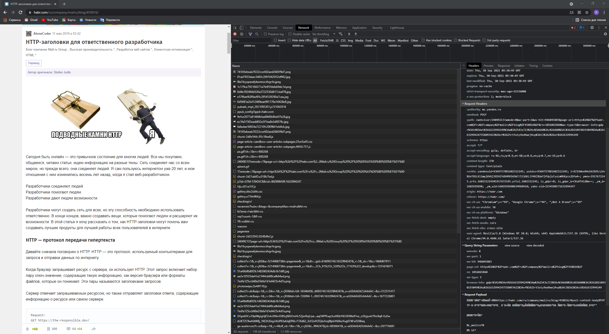

# Протокол HTTP. Основы работы с консолью разработчика в браузере

## Цель:
Получить практические навыки работы с HTTP протоколом. На практике отметить заголовки присущие Request и Response с помощью консоли разработчика в браузере в различных web-ресурсах.

## Постановка задачи
Написать эссе, отражающее особенности как минимум 10 уникальных HTTP-заголовков для Request и Response.

## Эссе
Рассмотрим [эту](https://habr.com/ru/company/mailru/blog/450816/) статейку с хабра



При переходе на страничку отправляется следующий запрос:

```yaml
:authority: mc.yandex.ru
:method: POST
:path: /webvisor/24049213?wmode=0&wv-part=1&wv-hit=946045803&page-url=https%3A%2F%2Fhabr.com%2Fru%2Fcompany%2Fmailru%2Fblog%2F450816%2F&rn=1056865860&wv-type=5&browser-info=gdpr%3A14%3Aet%3A1632994249%3Aw%3A2543x723%3Av%3A660%3Az%3A600%3Ai%3A20210930193049%3Au%3A1632994247558093422%3Avf%3A25rt5xty9ed9wej4vp%3Ati%3A2%3Ast%3A1632994249
:scheme: https
accept: */*
accept-encoding: gzip, deflate, br
accept-language: ru-RU,ru;q=0.9,en-GB;q=0.8,en;q=0.7,en-US;q=0.6
content-length: 370
content-type: text/plain
cookie: yandexuid=9369757881602312145; yuidss=9369757881602312145; i=XZ1VWke84oS6Z6OS/yUvBUnT8SLKiimpj6V6jJG5H2YdX4MVSA5W7/5lSGKLiY4KCBUaYjfUpjsFyuLmMUKpzs2Dfa4=; ymex=1917672145.yrts.1602312145#1917672145.yrtsi.1602312145; is_gdpr=0; is_gdpr_b=CKuXThCdBw==; _ym_d=1602929690; _ym_uid=1602929690634968410; yabs-sid=2154580571632994247
origin: https://habr.com
referer: https://habr.com/
sec-ch-ua: "Chromium";v="94", "Google Chrome";v="94", ";Not A Brand";v="99"
sec-ch-ua-mobile: ?0
sec-ch-ua-platform: "Windows"
sec-fetch-dest: empty
sec-fetch-mode: cors
sec-fetch-site: cross-site
user-agent: Mozilla/5.0 (Windows NT 10.0; Win64; x64) AppleWebKit/537.36 (KHTML, like Gecko) Chrome/94.0.4606.61 Safari/537.36
```

Парочку заголовочков рассмотрим туда-сюда:

- Заголовок `accept-encoding` объявляет, какие кодировки контента и алгоритмы сжатия поддерживает браузер. В данном случае браузер объявляет о том, что поддерживает методы сжатия gzip, deflate и br.

- Заголовок `accept-language` сообщает серверу, какие языки клиент понимает и какая локаль предпочтительнее. Также в заголовке может указываться параметр `q`, который устанавливает предпочтение в выборе данной локали.

- Заголовок запроса `origin` показывает откуда будет производиться загрузка. Он не включает в себя какую-либо информацию о пути, содержит в себе лишь имя сервера. Заголовок отправляется как с `CORS`, так и с `POST` запросами. Он похож на заголовок `referer`, но, в отличие от этого заголовка, не раскрывает весь путь.

- Заголовок запроса `referer` содержит URL исходной страницы, с которой был осуществлён переход на текущую страницу. Заголовок `referer` позволяет серверу узнать откуда был осуществлён переход на запрашиваемую страницу. Сервер может анализировать эти данные, записывать их в логи или оптимизировать процесс кеширования.

- Заголовок `user-agent` позволяет идентифицировать браузер. Файл агента пользователя чаще всего включает в себя сведения о браузере, его версии, используемом устройстве, операционной системе и механизме веб-рендеринга.

- Заголовок `sec-fetch-site` извлечения метаданных заголовка указывает на взаимосвязь между происхождения на просьбу инициатора и происхождения ресурса.

В ответ на данный запрос мы получаем следующее:

```yaml
access-control-allow-credentials: true
access-control-allow-origin: https://habr.com
cache-control: private, no-cache, no-store, must-revalidate, max-age=0
content-length: 43
content-type: image/gif
date: Thu, 30 Sep 2021 09:30:49 GMT
expires: Thu, 30-Sep-2021 09:30:49 GMT
last-modified: Thu, 30-Sep-2021 09:30:49 GMT
pragma: no-cache
strict-transport-security: max-age=31536000
x-xss-protection: 1; mode=block
```

- Заголовок ответа `access-control-allow-origin` показывает, может ли ответ сервера быть доступен коду, отправляющему запрос с данного источника origin.

- Заголовок `x-xss-protection` HTTP X-XSS-Protection это особенность Internet Explorer, Chrome и Safari, которая останавливает загрузку страниц при обнаружении XSS атаки. `1; mode=block` ключает фильтрацию XSS. Вместо того, чтобы очищать содержимое страницы, браузер предотвратит отображение страницы, если заметит атаку.

- Заголовок `date` содержит дату и время, в которое сообщение было создано.

- Общий заголовок `pragma` HTTP / 1.0 - это заголовок, зависящий от реализации, который может иметь различные эффекты в цепочке запрос-ответ. Он используется для обратной совместимости с кешами HTTP / 1.0, где заголовок `cache-control` HTTP / 1.1 ещё не присутствует.

- HTTP `strict-transport-security` - заголовок ответа (часто используется аббревиатура HSTS), позволяющий web-сайтам уведомить браузер о том, что доступ к ним должен быть осуществлён только посредством HTTPS вместо HTTP.

- Заголовок-сущность `content-type` используется для того, чтобы определить MIME тип ресурса. В ответах сервера заголовок Content-Type сообщает клиенту, какой будет тип передаваемого контента.

- Заголовок `expires` содержит дату/время, по истечении которой ответ сервера считается устаревшим.

## Вывод:
Таким образом, мы получили практические навыки работы с HTTP протоколом. На практике отметили заголовки присущие Request и Response с помощью консоли разработчика в браузере.

